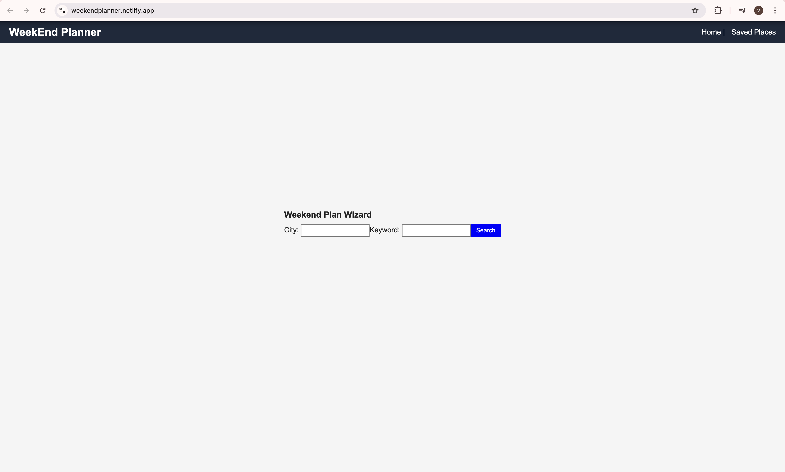
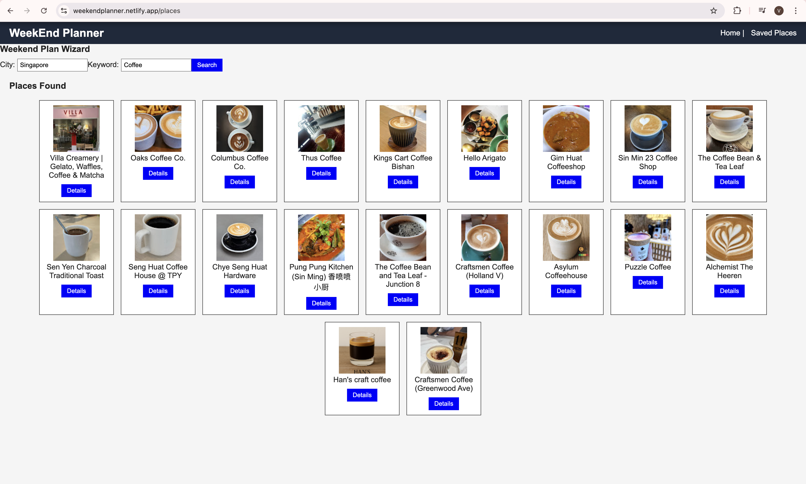
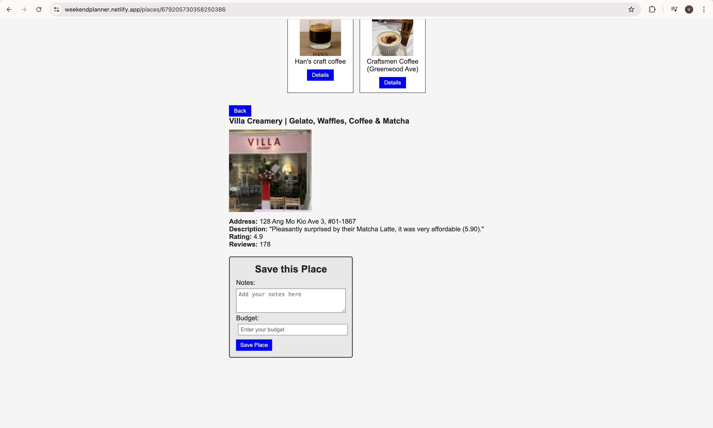
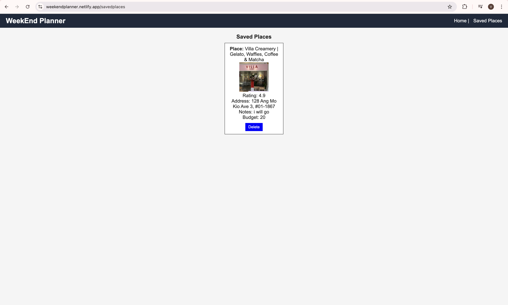

# Weekend Plan Wizard
# 5.1 Screenshot / Logo
i) Home Page

ii) Places Page 

iii) Place Details Page

iv) Saved Places page

# 5.2 App Name & Description

Weekend Plan Wizard

Weekend Plan Wizard is a React-based web application that helps users discover, explore, and save places for their weekend plans.
By entering a city and keyword, users can instantly view nearby places with thumbnails, ratings, reviews, addresses where the details are   fetched via the SerpAPI (Google Local Results API).

Users can also save their favorite place to Airtable, along with notes and budget details, creating a personal weekend collection.

Background

I built this app to make planning weekend outings effortless — eliminating the need to switch between Google Maps, review websites, and note apps.

# 5.3 Getting Started
Project planning link: https://trello.com/b/nSyb4rYG/weekend-plan-wizard

Deployed project link: https://weekendplanner.netlify.app/

# 5.4 Attributions

APIs and External Resources:

SerpAPI – Google Local Results

Used to fetch real-time local business and place information  based on user entered city and keyword. It search results displayed on the Places page is the data from this SerpAPI - Google Local Result

Airtable API

Used as a  database to store saved places. Each saved record includes the thumbnail, place name, rating, address, notes, and budget, making it easy to show or delete saved places.

Documentation References:

MDN Web Docs – encodeURIComponent

Referenced to properly encode API query parameters (like city and keyword) before sending them through the SerpAPI URL, ensuring accurate and safe API requests.

MDN – CORS Guide

Used to understand and manage Cross-Origin Resource Sharing (CORS) issues during API calls, especially when connecting the React frontend to third-party APIs.

Stack Overflow – No Access-Control-Allow-Origin Header Fix

Helped implement a proxy() to avoid CORS restrictions while fetching data from the SerpAPI securely.

# 5.5 Technologies Used

Libraries:

React Router

Used for routing and navigation between pages such as Home, Places, Details, and Saved Places without reloading the app.

Vite

Used as the development and environment variable handling in the React project.

# 5.6 Next Steps

1) Add rating filters: Allow users to filter displayed places based on their ratings to view only top-rated options.

2) Implement user authentication: Enable login functionality so users can securely save and retrieve their data across sessions.

3) Sort saved places: Add a feature to sort saved locations by rating or other criteria for better organization.

4) Add pagination: Display search results across multiple pages so users can easily browse through larger datasets.

5) Provide Star ratind instead of number in Places Details Page